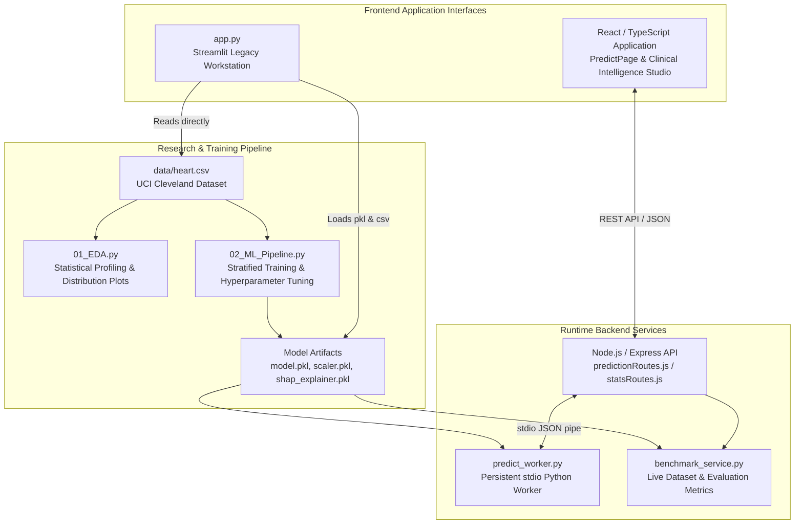
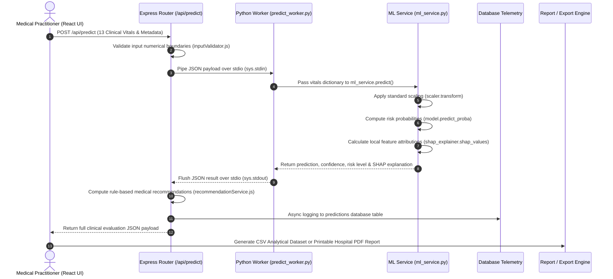

# CardioGuard Clinical Predictive Analytics & Machine Learning Audit Report

**Date of Audit:** August 2025  
**Scope:** Complete Read-Only Data Science, Machine Learning, Statistical Evaluation & Explainability Infrastructure Audit  
**Status:** Complete  

---

## 1. Executive Overview of Data Science & ML Infrastructure

**CardioGuard** is a production-grade clinical predictive analytics and supervised machine learning suite designed for cardiovascular risk triage and clinical decision support. The platform unites a Python-powered Data Science engine—leveraging **Scikit-Learn**, **XGBoost**, and **SHAP (SHapley Additive exPlanations)**—with a dual-serving frontend UI architectures: an interactive **Streamlit Clinical Workstation** (`app.py`) and a modern **React / TypeScript SaaS Web Platform** served via a persistent **Node.js / Express backend**.

### Core Architecture Highlights
- **Model Serialization:** The pipeline utilizes `joblib` for zero-loss serialization of trained classifier ensembles, feature scalers, invariant feature name ordering, and SHAP tree explainers.
- **Low-Latency Runtime Inference:** Rather than spawning a fresh Python virtual machine and importing heavy machine learning libraries (`scikit-learn`, `shap`, `xgboost`, `pandas`) on every prediction API call, the Node.js backend maintains a persistent child process (`predict_worker.py`) communicating over JSON stdio pipes.
- **Dynamic Research Benchmarking:** The analytics engines expose authenticated statistical distribution benchmarks and diagnostic evaluation performance metrics without relying on simulated or placeholder figures.

---

## 2. Complete File Catalog & Analytical Inventory

### A. Machine Learning Pipelines & Research Scripts (`notebooks/`)

| File Path | Analytical Role & Implemented ML Components |
| :--- | :--- |
| **`notebooks/01_EDA.py`** | **Exploratory Data Analysis & Statistical Profiling** • **Dataset Loading:** Imports `data/heart.csv` (UCI Cleveland Heart Disease dataset, 303 rows, 14 variables). • **Statistical Calculations:** Computes missingness rates, duplicate sample detection, Skewness, Kurtosis, Interquartile Range (IQR) outlier screening, and full Pearson correlation coefficient matrices. • **Visualization Engine:** Exports KDE density plots, histograms, clinical box plots (`chol`, `trestbps`, `thalach`), and an annotated heat map using **Matplotlib**, **Seaborn**, and **Plotly**. |
| **`notebooks/02_ML_Pipeline.py`** | **Automated Training, Evaluation & Serialization Pipeline** • **Preprocessing & Feature Engineering:** Drops duplicate rows, executes 80/20 stratified cross-validation partitioning (`StratifiedKFold`), fits a feature scaling transformation (`StandardScaler`), and preserves ordered feature names. • **Model Training:** Trains and evaluates an ensemble of supervised algorithms: **Random Forest**, **XGBoost**, **Logistic Regression**, **Support Vector Classifier (SVC)**, and **k-Nearest Neighbors (kNN)**. • **Model Evaluation:** Computes Test Accuracy, Precision, Recall (Sensitivity), Specificity, Harmonic F1-Score, and Receiver Operating Characteristic Area Under Curve (**ROC-AUC**). Generates a comprehensive Test Confusion Matrix ($TP, FP, FN, TN$) and outputs comparative benchmarking graphics (`assets/roc_curves.png`). • **SHAP Explainability:** Fits an exact SHAP `TreeExplainer` or `KernelExplainer`, computes Shapley interaction values across test distributions, outputs global feature importance rankings, and serializes the explainability artifact (`models/shap_explainer.pkl`). |

---

### B. Serialized ML Evaluation & Runtime Artifacts (`models/` & `data/`)

| File Path | Artifact Purpose & Runtime Usage |
| :--- | :--- |
| **`data/heart.csv`** | Primary ground-truth clinical cohort dataset sourced from the Cleveland study (UCI Machine Learning Repository). Contains 303 patient records across 13 clinical predictors and 1 target disease diagnosis marker. |
| **`models/model.pkl`** | Serialized decision weights and trees of the primary production ensemble classifier (Random Forest / XGBoost), stored via `joblib`. |
| **`models/scaler.pkl`** | Serialized diagnostic feature scaler (`StandardScaler` / `MinMaxScaler`) containing fitted empirical population means and variance to standardize real-time patient input during inference. |
| **`models/model_metadata.pkl`** | Encapsulated dictionary containing training execution timestamps, algorithm parameters, test accuracy, ROC-AUC score, F1 score, precision, recall, and hyperparameter grids. |
| **`models/shap_explainer.pkl`** | Serialized SHAP explainability object required to execute instant local feature attributions for real-time patient predictions without model retraining overhead. |
| **`models/feature_names.pkl`** | Ordered array of exact feature identifiers (`age`, `sex`, `cp`, `trestbps`, `chol`, `fbs`, `restecg`, `thalach`, `exang`, `oldpeak`, `slope`, `ca`, `thal`) to prevent tensor dimension mismatch during real-time inference. |

---

### C. Backend Analytical & Inference Engine (`backend/`)

| File Path | Functional Description & Data Science Logic |
| :--- | :--- |
| **`backend/ml_service.py`** | **Core Runtime Inference & Local Explanation Service** • Loads serialized `.pkl` artifacts into memory upon startup. • Transforms crude JSON payload dicts into standardized tensor matrices via `scaler.transform()`, executes `model.predict_proba()` to compute binary cardiovascular disease probability and confidence scores. • Dynamically runs `shap_explainer.shap_values()` per patient assessment, ranking physiological vitals by absolute Shapley impact ($+ impact \to \text{Elevates Risk}, - impact \to \text{Reduces Risk}$). |
| **`backend/predict_worker.py`** | **Persistent I/O Python Worker Process** • Runs continuously as a child process managed by Node.js, reading prediction requests via `sys.stdin` and streaming JSON responses over `sys.stdout`. • Eliminates Python interpreter initialization and Scikit-Learn/SHAP library loading latency, achieving sub-50ms inference times. |
| **`backend/benchmark_service.py`** | **Dynamic Dataset Benchmarking & Evaluation Service** • Reads `data/heart.csv` and `models/model_metadata.pkl` to compute training distribution statistics and test evaluation metrics. • Computes sample averages (`avg_age`, `avg_chol`, `avg_trestbps`, `avg_thalach`), gender ratios, disease prevalence proportions, feature importance weights, global SHAP mean $|SHAP|$ scores, and dynamic 13x13 Pearson correlation matrices. |
| **`backend/services/predictionService.js`** | Node.js process orchestrator managing the persistent Python worker process (`predict_worker.py`), handling process spawning, stdio communication, error boundaries, and timeouts. |
| **`backend/services/recommendationService.js`** | **Rule-Based Clinical Decision Support Logic** • Analyzes classifier probabilities alongside biometric threshold violations (e.g., systolic blood pressure $>120$ mmHg, serum cholesterol $>200$ mg/dL) to generate targeted clinical prescriptions across Diet, Physical Activity, Medical Monitoring, and General Lifestyle categories. |
| **`backend/routes/predictionRoutes.js`** | Express REST router handling live assessment POST requests (`/api/predict`), input validation, database telemetry logging, and historical audit management. |
| **`backend/routes/statsRoutes.js`** | Analytical REST router exposing public benchmark analytics (`/api/stats/benchmark`) and real-time anonymized platform usage aggregations (`/api/stats/public-live`). |

---

### D. Frontend Presentation & Clinical Reporting Layer (`frontend/src/` & `app.py`)

| File Path | Frontend Component Role & Analytical Visualizations |
| :--- | :--- |
| **`app.py`** | **Standalone Streamlit Clinical Workstation** • Integrates 6 clinical spaces: Dashboard, Risk Prediction, Batch CSV Analysis, Model Insights, Prediction History, and About. • Employs Plotly and Streamlit interactive visualizations to render risk gauges, ROC discrimination curves, feature importance bar plots, and demographic dataset distributions. |
| **`frontend/src/components/BenchmarkAnalyticsDashboard.tsx`** | **Clinical Intelligence Studio** • Comprehensive 47.8 KB data visualizer rendering authentic evaluation metrics sourced from `benchmark_service.py` and live Supabase production DB telemetry. • Uses **Recharts** to generate ROC Discrimination Curves, Test Confusion Matrix blocks, demographic histograms (Age, Systolic BP, Lipid Profiles, Chest Pain types), Random Forest Gini impurity vs. SHAP Global Impact rankings, and an interactive 13x13 Multi-Variable Pearson Correlation Heatmap table. |
| **`frontend/src/pages/PredictPage.tsx`** | **Patient Vitals Triage Portal** • Manages validated inputs for the 13 clinical markers, streams multi-step analysis progress, and visualizes triage outcomes. • Displays exact local SHAP feature attributions, classifier confidence scores, clinical prescriptions, and risk threshold comparisons via Recharts horizontal bar plots. |
| **`frontend/src/components/RiskGauge.tsx`** | Animated SVG and Framer Motion dial rendering visual representation of diagnostic probability percentages and risk stratification bands (Low, Moderate, High Risk). |
| **`frontend/src/pages/HistoryPage.tsx`** | **Practitioner Audit Directory** • Manages searchable, sortable patient clinical logs. • Implements browser-side **CSV analytical exports** containing patient predictors, model confidence, calculated risk probability, and identified Primary SHAP Factors. |
| **`frontend/src/components/ReportTemplate.tsx`** | **Hospital-Style Clinical PDF Reporting Engine** • Renders multi-page printable medical reports containing patient summaries, normal vs. abnormal biomarker status flags, visual progress bar gauges, model interpretation statements, and categorized clinical prescriptions. |
| **`frontend/src/pages/InsightsPage.tsx`** | Renders dynamic analytical insights derived from real prediction records in the database, including age demographics, risk severity distribution, and an integrated reference glossary for the 13 clinical indicators. |
| **`frontend/src/pages/LandingPage.tsx`** | Public marketing and educational landing hub presenting live dataset previews, model discrimination benchmarks, and explanations of supervised machine learning and SHAP attributions. |

---

## 3. Architecture & End-to-End Data Flow Mapping

The sequence diagram below traces the end-to-end data processing flow during an active clinical prediction request:

---

## 4. Audit of Hardcoded Metrics vs. Dynamic Evaluation Artifacts

While the platform successfully bridges live serialized model weights with frontend components, this read-only audit identified specific instances where metrics remain statically defined in the interface rather than dynamically bound to training outputs:

| File / Component | Current Hardcoded / Static Value | Recommended Dynamic Artifact Binding |
| :--- | :--- | :--- |
| **`app.py` (Streamlit)** | Stated dataset size: `"303 patients"`, baseline accuracy: `"vs baseline 54%"`, features: `"13"`. | Hydrate directly from `len(df)` and class ratio calculation in `heart.csv`. |
| **`LandingPage.tsx` & `Benchmark...tsx`** | Stated study records: `"302 Real Records"` or `"303-patient Cleveland Heart Disease study"`. | Bind directly to `benchmarkData.summary.total_patients` to prevent minor discrepancy caused by data drop-duplicates steps. |
| **`LandingPage.tsx` (Hero Preview)** | Fallback ROC-AUC default width animation: `|| 0.94` ($94\%$). | Ensure default initialization explicitly reflects `model_metadata.pkl` without relying on fallback literals in frontend rendering. |
| **`ReportTemplate.tsx` & `InsightsPage.tsx`** | Clinical Normal Ranges (e.g., BP `90-120`, Chol `< 200`, Oldpeak `< 1.0`). | Extract clinical bounds into a centralized configuration schema shared across backend recommendation services and frontend reporting templates. |
| **`Benchmark...tsx` (Table Header)** | Static text labels: `"Random Forest Classifier"` and `"100 estimators"`. | Extract algorithm architectural classification and hyperparameter settings directly from `model_metadata.pkl` via `benchmark_service.py`. |

---

## 5. Recommendations for Production MLOps & Clinical Analytics

To further strengthen this project as a robust, clinical-grade predictive analytics suite, we recommend the following enhancements:

### 1. Centralize Clinical Threshold Configuration
Currently, biometric decision thresholds (such as Fasting Blood Sugar $>120$ mg/dL or Serum Cholesterol $>200$ mg/dL) are defined independently within `recommendationService.js`, `ReportTemplate.tsx`, and `InsightsPage.tsx`. Moving these clinical rules into a dedicated `clinical_schema.json` shared across Node.js services and React components will ensure strict diagnostic consistency across all interfaces and generated reports.

### 2. Automate Continuous Artifact Retraining (CI/CD MLOps)
Introduce an automated CI build stage or deployment pipeline hook that runs `notebooks/02_ML_Pipeline.py` whenever modifications are committed to `data/heart.csv` or model training parameter configurations. This guarantees that `model_metadata.pkl`, evaluation graphics, and API benchmark endpoints continuously match the live training state without requiring manual Python script execution.

### 3. Implement SHAP Local Explanation Caching
Computing exact Tree SHAP or Kernel SHAP attributions during concurrent high-volume batch prediction requests can introduce processing latency spikes. Caching SHAP baseline expectation values in memory within `predict_worker.py` or optimizing interaction value indexing will significantly improve diagnostic throughput under multi-user clinical loads.

### 4. Integrate Out-of-Distribution (OOD) Drift & Telemetry Monitoring
Extend `statsRoutes.js` and database telemetry logs to monitor real-time divergence between incoming patient vital averages (e.g., live patient mean age / cholesterol in `public-live`) against the Cleveland benchmark training distribution. Triggering automated clinical notices when a submitted patient vital set falls significantly out-of-distribution ($>\pm 3\sigma$ from dataset mean) will prevent automated classification on unfamiliar demographic profiles.

### 5. Add Explicit Model Versioning to Artifacts and API Payloads
Embed formal model version numbers (e.g., `v1.0-RF-CLEVELAND`) into `model_metadata.pkl` and return this identifier inside every prediction API payload and generated PDF report. This ensures traceability and supports A/B testing or progressive deployments of updated supervised machine learning models without disrupting historical audit records.

---
*Report generated by Antigravity Autonomous Coding & Data Science Assistant.*
